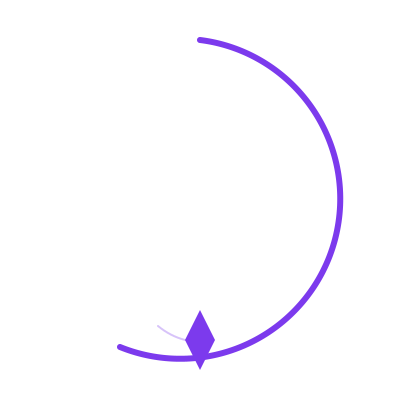

<p align="center">
  <picture>
    <source media="(prefers-color-scheme: dark)" srcset="logo.svg">
    
  </picture>
</p>

<h1 align="center">Productfound</h1>

<p align="center">
  <em>Market research from 1,000 failed startups.</em><br>
  Find the gap before you build. Validate before you commit.
</p>

<p align="center">
  <a href="https://github.com/jithindeepjc/productfound/stargazers">
    
  </a>
  <a href="https://github.com/jithindeepjc/productfound/forks">
    
  </a>
  <a href="./LICENSE">
    
  </a>
  <a href="./skill/SKILL.md">
    
  </a>
</p>

<p align="center">
  <a href="#why">Why</a> ·
  <a href="#ai-skill">AI Skill</a> ·
  <a href="#dataset">Dataset</a>
</p>

---

## Why

90% of startups fail. Every postmortem tells the same story: a founder bet on an idea nobody validated, in a market they didn't understand, with a model that couldn't sustain them.

This is 1,000 of those ideas — extracted, categorized, tagged, and ranked. Not guesses. Not speculation. Real ideas that real people bet their careers on.

**Use this to:**

- **Find underserved markets** — categories with the fewest attempts signal the largest gaps
- **Validate your idea** — stress-test against similar bets that failed
- **Spot antipatterns** — recurring patterns that killed companies in your space
- **Ship faster** — know which model-effort-speed combos actually work

---

## AI Skill

This repository is a self-contained skill for AI coding agents (OpenCode, Claude Code, Cursor, Copilot, Gemini CLI):

```bash
cp -r skill /path/to/your/skills/productfound-market-researcher
```

The skill turns any agent into a market researcher. No installs, no dependencies, no API keys. Ask:

> *"What's the most underserved category?"*
> *"Validate my idea for a fintech SaaS"*
> *"Compare these three ideas"*
> *"I've been building for two months — assess my market"*

Seven analysis types, persona self-selector, risk flag detection, confidence scoring, JSON output mode.

| Analysis | What it does |
|----------|-------------|
| `gaps` | Find underserved categories and first-mover opportunities |
| `validate` | 4-axis stress-test (Gap Clarity, Model Fit, Effort Realism, Speed vs Runway) |
| `competitive` | Category density, dominant models, risk tags |
| `persona` | Match ideas to builder profiles |
| `trends` | Model/tag/effort pattern surfacing |
| `compare` | Side-by-side scorecard across multiple ideas |
| `assess` | Evaluate an existing product against the dataset |

**Full documentation:** [`skill/SKILL.md`](./skill/SKILL.md)

---

## Dataset

### Ideas (1,000)

| Dimension | Details |
|-----------|---------|
| Ideas | 1,000 AI-generated from real postmortem patterns |
| Categories | 28 (DevTools, Health, Fintech, Ecommerce, AI-Tools, LegalTech, etc.) |
| Business models | 18 (SaaS, Marketplace, Freemium, API-First, etc.) |
| Tags | 142 |
| Builder personas | 5 |
| Effort levels | Weekend Project — 6+ Months |
| Speed tiers | Quick Cash — Long Game |

### Postmortems (41 real companies)

Real failed startups from around the world with structured data:

| Region | Companies | Capital lost | Top failure reason |
|--------|-----------|-------------|-------------------|
| US | 18 | $23.7B | Unit Economics |
| India | 10 | $8.2B | Fraud / Governance |
| Europe | 5 | $20.9B | Execution |
| SEA | 3 | $850M | Unit Economics |
| LATAM | 2 | $3.6B | Unit Economics |
| Africa | 2 | $350M | Execution |
| Global | 1 | $200M | Fraud / Governance |

MIT license. Free. Open source.

---

## Share

<p align="center">
  <a href="https://twitter.com/intent/tweet?text=Productfound%20%E2%80%94%20Market%20research%20from%201%2C000%20failed%20startups.%20AI%20skill%20that%20finds%20market%20gaps%20from%20real%20postmortems.&url=https%3A%2F%2Fgithub.com%2Fjithindeepjc%2Fproductfound">
    
  </a>
  <a href="https://news.ycombinator.com/submitlink?u=https%3A%2F%2Fgithub.com%2Fjithindeepjc%2Fproductfound&t=Productfound%20%E2%80%94%20Market%20research%20from%201%2C000%20failed%20startups">
    
  </a>
  <a href="https://www.reddit.com/r/startups/submit?url=https%3A%2F%2Fgithub.com%2Fjithindeepjc%2Fproductfound&title=Productfound%20%E2%80%94%20Market%20research%20from%201%2C000%20failed%20startups">
    
  </a>
  <a href="https://www.linkedin.com/sharing/share-offsite/?url=https%3A%2F%2Fgithub.com%2Fjithindeepjc%2Fproductfound">
    
  </a>
</p>

---

<p align="center">
  <a href="https://github.com/jithindeepjc/productfound">GitHub</a> ·
  <a href="https://github.com/jithindeepjc/productfound/issues">Issues</a> ·
  <a href="https://github.com/jithindeepjc/productfound/blob/master/LICENSE">MIT License</a>
</p>
